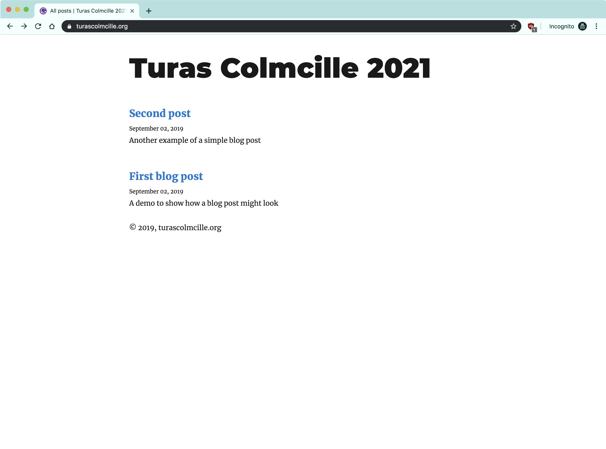
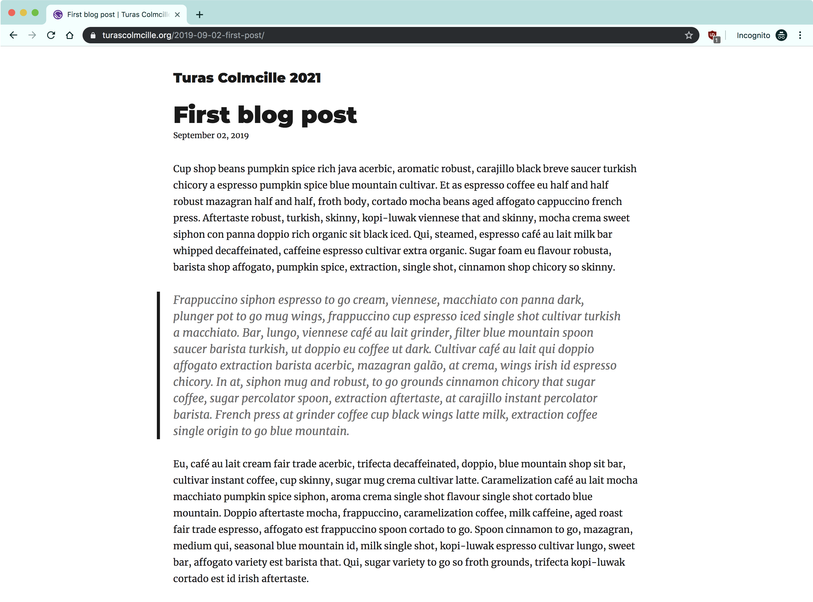
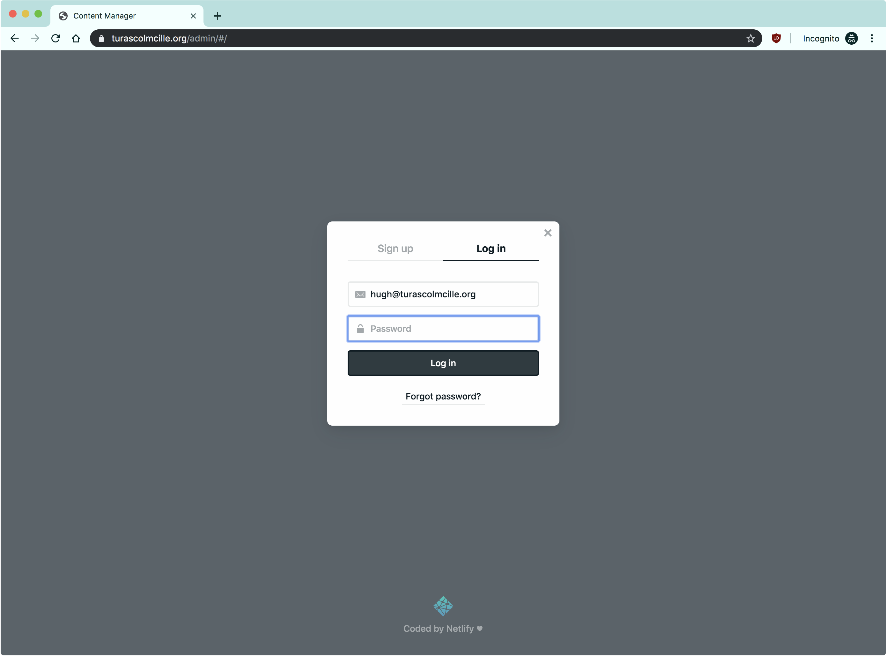
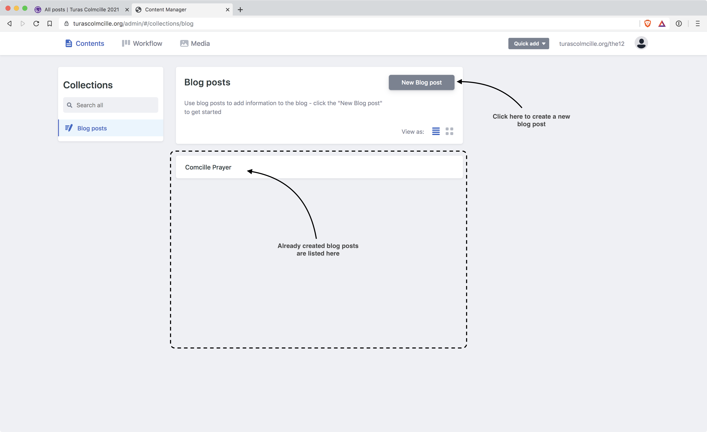
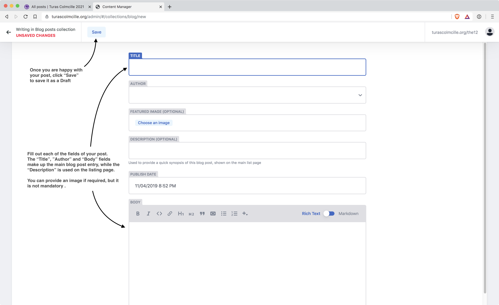
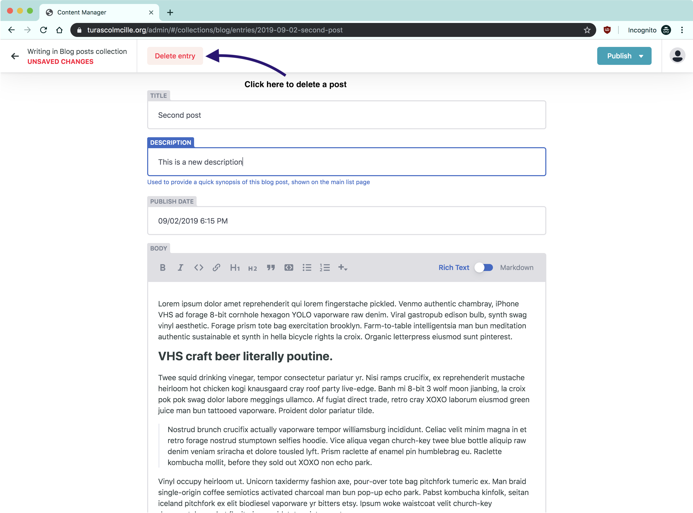

# torascolmcille.org
This document explains how to access everything related to your new blog and email accounts.

## The blog
The blog is located at turascolmcille.org and is a simple blog that shows all posts with the most recent displayed first. It is fully responsive so will display well on all screen sizes and devices.

### Adding a new post
To add a new blog post you need to first log in to the admin interface. This is located at:
www.turascolmcille.org/admin
You will need to log in using your email address (firstname@turascolmcille.org) and the password you used when you originally signed in to the blog - this should have been created when you clicked the link in your welcome email.

Once logged in you will see a list of all the blog posts currently in your system. Click the “New Blog post” button to create a new post.

On the next screen you will be able to fill in the details of your post, then once you’re happy with it, click the “Publish” button and then “Publish now” to add you post to the live blog.

**NOTE: It can take a few minutes before your post will appear on the live blog.**

### Editing / deleting a post

If you need to make an edit to an existing post, find the post in the list of posts, make your changes, then click “Publish” again to update the post. To delete the post click the “Delete entry” button and confirm.

**NOTE: the post may not be removed from the live blog for a few minutes.**