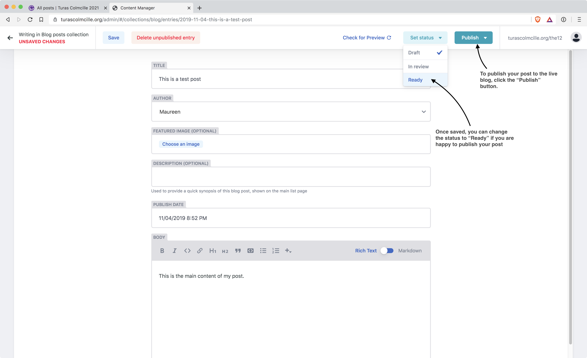
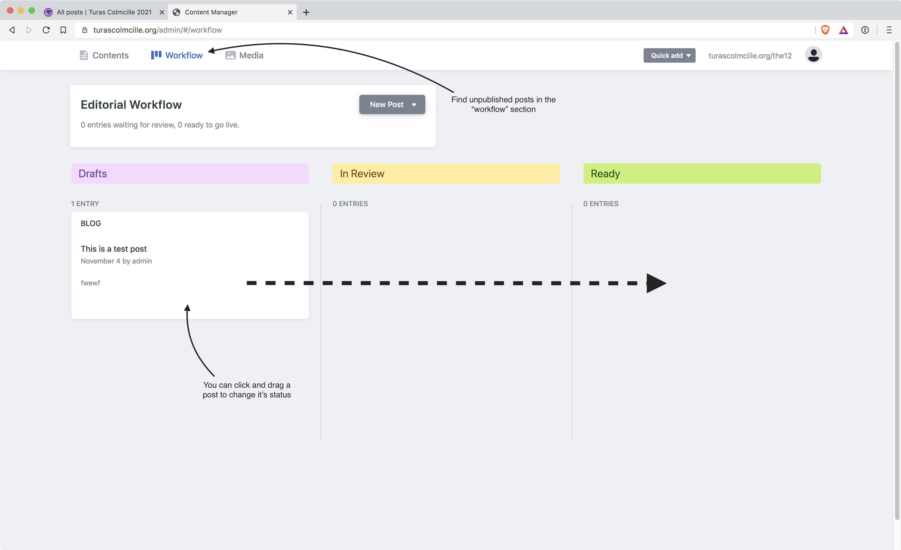

# turascolmcille.org
This document explains how to access everything related to your new blog. It is also available at https://github.com/hughlaw/colmcille2021/tree/master/documentation

## The blog
The blog is located at turascolmcille.org/the12 and is being used to gather information for possible future projects. The blog lists all posts with the most recent displayed first. It is fully responsive so will display well on all screen sizes and devices.

### Adding a new post
To add a new blog post you need to first log in to the admin interface. This is located at:
www.turascolmcille.org/admin
You will need to log in using the admin email address (admin@turascolmcille.org) - you will have been provided with the admin password separately.

Once logged in you will see a list of all the blog posts currently in your system. Click the “New Blog post” button to create a new post.

On the next screen you will be able to fill in the details of your post, then once you’re happy with it, click the "Save" button. This saves your post as a draft. After a minute or so, you will see some additional buttons appear allowing you to set the status to "Ready" and then publish your post to the live blog. You can also delete the post from this screen.

When the post has been saved as a Draft, you have the opportunity to preview what it will look like on the live blog.

If you want to preview it first, it may take a minute or two before a preview has been built. Click the "Check for Preview" link in the header and when a preview is available the link will change to "View Preview".

When you're ready to publish your post, change the Status to "Ready" and click the "Publish" button.

### Editorial workflow
Posts on the blog go through a "workflow" where they start as a "Draft", and from there they can either move to "In Review" or "Ready". Most of the time, a post author will simply change the status to "Ready" and publish immediately, but if you have drafts that you or other authors have created, then these can be found under the "Workflow" tab.

### Editing / deleting a post

If you need to make an edit to an existing post, find the post in the list of posts, make your changes, then click “Publish” again to update the post. To delete the post click the “Delete entry” button and confirm.

**NOTE: the post may not be removed from the live blog for a few minutes.**
